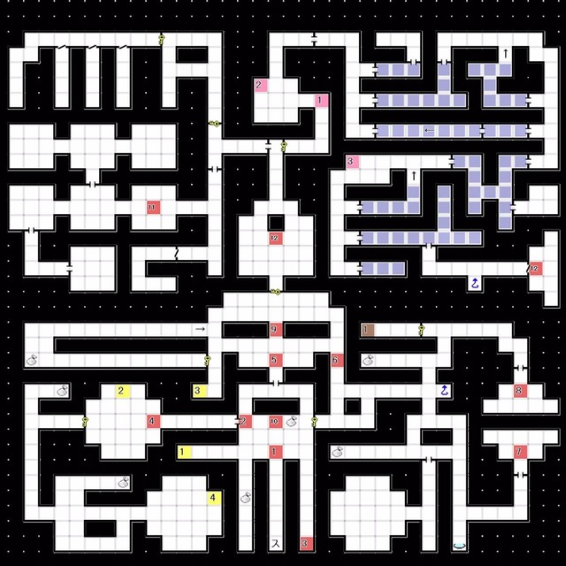
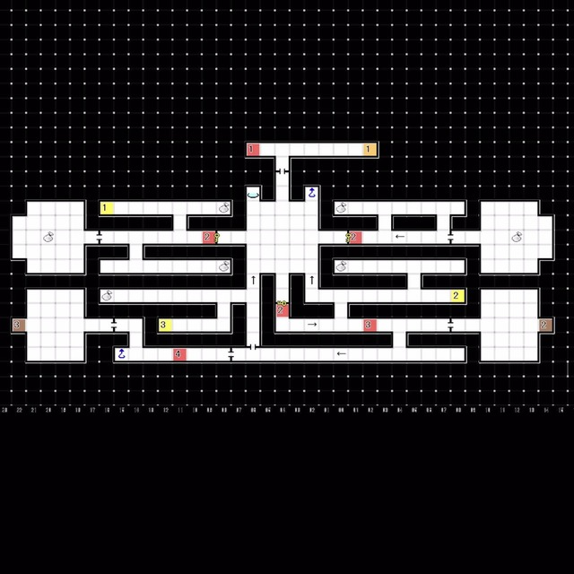
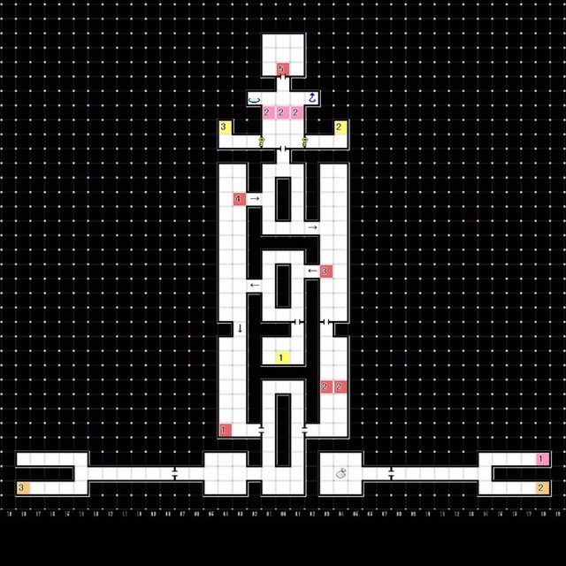

# 红色精灵号 
- 现在开始可以进行**恶魔合体**了
- 与 希门尼斯 对话  
  └ 自己也是 / 如果有必要的话 / 应该小心对待恶魔  
---
# 唧筒座     
### 1F 
   
获得了「解锁A」之后可以打开一些以前打不开的门，前往下图所示地点，降至B1F  
![[一次性图示2.jpg]]  

 

### B1F   
   
- E2:与 希门尼斯 对话  
  └「我是疯了吗」  
  &emsp;└ 是的 / 不是，我也看到了战场  
- E3:与 机动班队员 对话  
  └「魔晶」的教程被追加至**文档**中
- E4:与 机动班队员 对话  
  └「恶魔合同」的教程被追加至**文档**中
- 前往B2F

 

### B2F   
 
- E2:与「妖鬼 鬼」战斗  
- E3:与「妖鬼 鬼」以及「堕天使 梅尔克」战斗
- E4:与「妖鬼 鬼」以及「魔兽 火鼠」以及「妖精 皮克西」x2 战斗
- 摩拉克斯Boss房前发生事件  
  └ 现在开始可以在恶魔全书中使用密码
- E5: 与 摩拉克斯 对话
  「恶魔这边不才是好人吗」
    └ 你说的也有道理 / 人类才是正确的 / 不管是恶魔还是人类都错了  
- 与 Lv10「魔王 摩拉克斯」战斗  
  └ 解禁了「魔王 摩拉克斯」的合体，获得「魔王的黄铜牛角」「谜之能量体」  
  摩拉克斯：HP 700 弱冰 耐枪火
- 剧情后强制回到红色精灵号