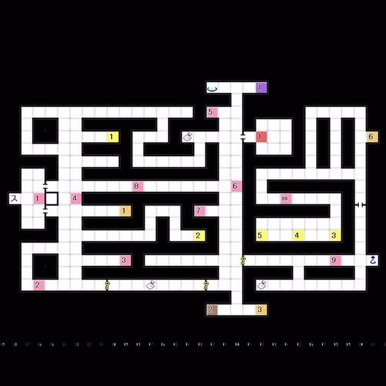
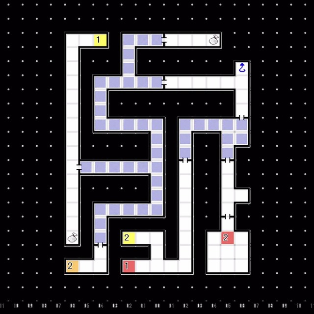
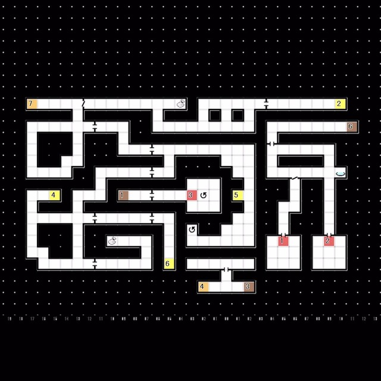

# 红色精灵号  
- 最多可同时持有的恶魔数量增加到15只
---
# 船底座 
### 1F 
   
- E1:与 马赛蒙特 对话
  └ 「你认可我与这里的恶魔不一样吧？」
  &emsp;└ 你值得信赖 / 好像是不一样 / 还不能这样说  

 

###  B1F 
   
- 突破黑暗区域
- E2:奥伽斯 事件
  └ 全员受到伤害
  &emsp;└ 要离开这里吗？
  &emsp;&emsp;└ 离开 / 不离开
  （选择**不离开**将受到更多伤害）
- 返回1F

 

### 1F 
   
- E1:与 马赛蒙特 对话
  └ 「要接受马赛蒙特的协助吗？」
  &emsp;└ 接受 / 不接受
- 接到任务「天使马赛蒙特要求的恶魔」  
  若此前没有获得「妖兽」或「女神」种族的恶魔可用下方密码召唤
  「妖兽」密码 ：まじゅうとりゅうおうきんだんのひじゅつ   
  「女神」密码：てんにょとてんしみわくのこらぼれーしょん
- 与 马赛蒙特 对话，交出其要求的恶魔，获得「示播列」
- 完成 M14「天使马赛蒙特要求的恶魔」
---
# 红色精灵号  
### 研究室  
- 获得「奥伽斯破坏炮」 
---
# 船底座  
### B1F 
 
- E2:发射「奥伽斯破坏炮」 └ 奥伽斯逃走了

 

### 1F 
 
- E1:发射「奥伽斯破坏炮」 └ 奥伽斯逃走了   
---
# 红色精灵号  
### 研究室  
- 获得主要应用「解锁B」 
---
# 船底座  
### 1F 
 
- 使用「解锁B」开门，经由东北方向的阶梯前往2F

 

### 2F 
] 
- E1:发射「奥伽斯破坏炮」 └奥伽斯逃走了
- E2:发射「奥伽斯破坏炮」 └奥伽斯逃走了
- 回到红色精灵号