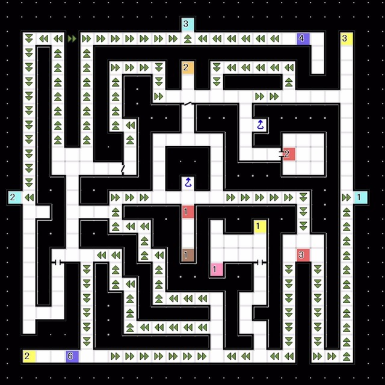
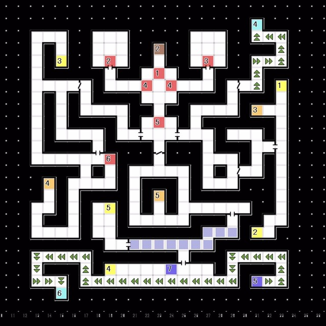

# 红色精灵号  
### 医疗室  
- 发生事件。接到任务M17「戈尔队长遗体失踪的调查」 
---
# 海豚座  

 
- E1:与 婕涅宁 对话  
  └ 「拜托了！能来帮帮忙吗？」
  &emsp;└ 知道了 / 你自己解决
- E2:与 婕涅宁 对话  
  └ 与「妖兽 鵺」x2 以及 「幽鬼 食尸鬼」x2 战斗

 

### 3F 
 
- E1:与 婕涅宁 对话  
  └ 「左或者右，你要去哪边？」
  &emsp;└ 右边 / 左边
- 选择右边的场合  
  └ E2发生事件
- 选择左边的场合
  └ E3发生事件
（此时无法去到比E5更深的地区）
- E4:从 婕涅宁 处获得「道行的勾玉」
- 与「人类 希门尼斯」战斗
- 回到红色精灵号 
---
# 红色精灵号 
- 与 婕涅宁 对话
  └ 「你还记不记得哪里见到过这样的异常」
  &emsp;└ 是有这种地方 / 在哪里？
  └ 「那个地方是在哪里？」
  &emsp;└ 唧筒座 / 牧夫座 / 船底座