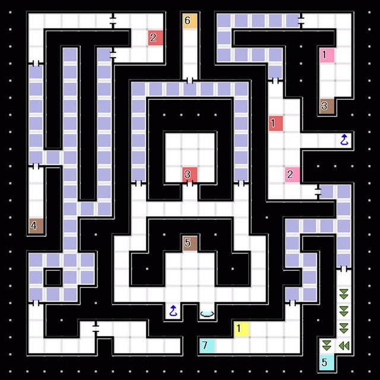
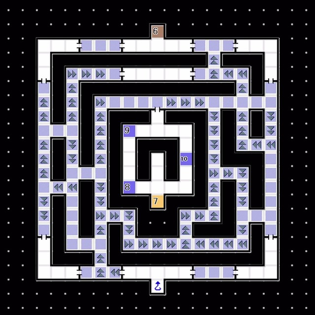
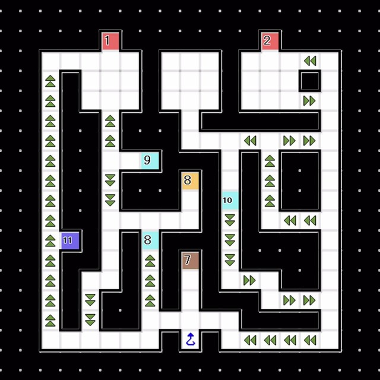

# 海豚座  
### 2F 
  
- E2:与「恶灵 无形之物」x2 战斗  弱火

 

### 3F 
 
- E2:与「恶灵 无形之物」x2 战斗，弱冰
- E3:与「恶灵 无形之物」x2 战斗，弱雷
- E5:与 戈尔队长 对话  
  └ 「你不打算终结人类对地球的支配吗？」
  &emsp;└ 要终结 / 不行
  完成任务 M17「戈尔队长遗体失踪的调查」

 

### 4F 
 
- E1:获得稀有素材「荧雪石」  
  └ 回到研究室，制造「不可视区域扫描A」
- 从 落穴7 处落下，前进

 

### 5F 
 
- 穿过不可视区域前往6F

 

### 6F 
  
- E1:按下开关，反转传送带的方向

 

### 7F 
  
- 按下E1处的开关反转传送带方向，前往E2
- 按下E2处的开关反转传送带方向，前往E3
- E3:与「恶灵 无形之物」x2 战斗 弱点为风
- 再度按下E1 E2处的开关前往E4
- E4:与「恶灵 无形之物」x2 战斗 弱点为火
（将 「恶灵 无形之物」全部打倒后将发生事件，4F E3地点将变为Boss房）

 

### 4F 
 
- E3:与 阿修罗 对话  
  └ 「要对人类之灵的衰弱视而不见吗？」
  &emsp;└ 这都是无稽之谈 / 恶魔才是起因 / 已经开始再生了
- 与 Boss Lv37 「魔王 阿修罗」战斗  
  └ 胜利后「魔王 阿修罗」合体解禁 获得「魔王的尺骨」「罗塞塔石：海豚座」
  Boss Lv37 「魔王 阿修罗」
  HP 约2000 耐枪 反火风 弱冰
  具有对全体附着 疯狂（攻击力提高，只会使用普通攻击且不分敌我） 的技能，且无法通过耐性或者技能防御，第一回合必定释放，请在第一回合进行防御抵挡异常状态
- 胜利后强制返回红色精灵号 
---
 
# 红色精灵号  
- 与 婕涅宁 对话  
  └ 「我们可以毫无顾虑地回去吗？」
  &emsp;└ 当然，我想快点回去 / 现在脱离的确不太合适 / 还不知道能不能回去呢
 