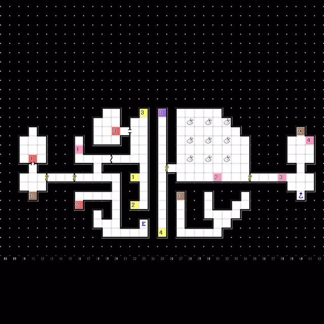

# 红色精灵号  
- 在研究室得到「暗门搜索B」 
---
 
# 牧夫座 
### 1F  

 
- E15: 与 马赛蒙特 对话  
  └ 「对于科技和恶魔这些强大的力量......？」
  &emsp;└ 只要小心使用就没有问题 / 因为没有办法才使用的 / 不想让你知道

 

### 8F 
  
- 从1F搭乘电梯前往5F,再搭乘电梯前往8F
- E3:事件后获得「狂者之石」，返回红色精灵号  
---
 
# 红色精灵号 
### 研究室 
- 获得「MK型治疗器」

 

### 医疗室 
- 治疗 医疗班成员
- 海豚座奇症的治疗法开发完成
- 前往海豚座