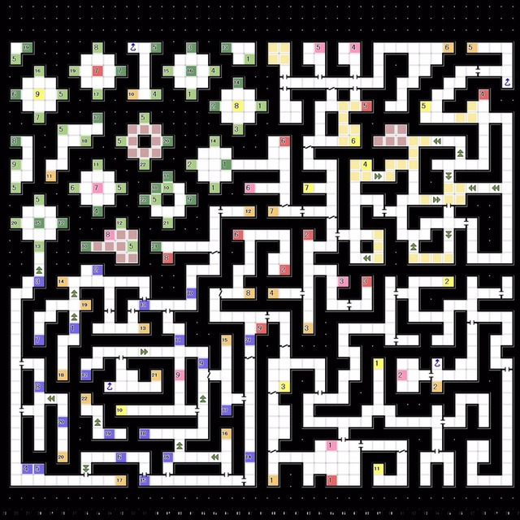
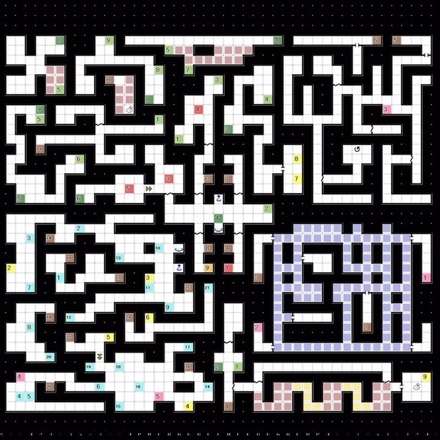
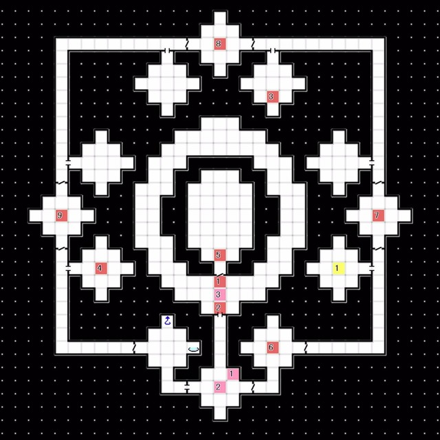

# 波江座 
### 1F 
 
- 经由 阶梯2 前往2F

 

### 2F 
  
- 离开不可视区域
- 经由 阶梯3 回到1F

 

### 1F 
 
- E2:与 婕涅宁 对话  
  └ 有 / 没有
- E3:获得稀有素材，回到研究室制造「素材搜索B」  
- E4:希门尼斯 事件
- 获得「帕特拉石」x5

  

### 2F 
 
- 经由 管制点 前往隐藏空间A 

波江座2F隐藏空间A
 
- E2:获得稀有素材「吸时性星彩宝石」

波江座2F隐藏空间B

 

### 1F 
 
- E5:唤醒睡着的队员
- E2:使用「吸时性星彩宝石」  
  └ 可以使用传送装置了

 

### 3F 
 
- 前往最上层

 

### 4F 
 
- E1:消失点前发生事件
- 回到红色精灵号