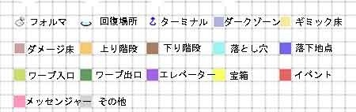

# 波江座 
### 4F 
 
- E2:与 杰克部队兵 对话  
  └ 获得主要应用「暗门搜索C」
- E5:与 乌洛波罗斯 对话   
  └ 人类的力量也是无限的 / 与恶魔战斗的力量不会耗尽 / 想要那种力量
- 与 Boss Lv43「龙王 乌洛波罗斯」战斗  
  HP 约2300 耐物枪 吸电 弱火
  Boss每回合自动回复一定血量
  小心全体光属性即死「玛翰玛」
  技能「灾厄的轮回」能造成大量伤害并附加异常状态，但是使用时机较好判断，及时使用指挥官技能 「勇敢的心」 来规避吧
- 战胜Boss后，Boss复活，全员受到伤害
- E6:与 Lv43「妖树 曼德拉草」x3 战斗
  └ 弱火
- E7:与 Lv43「地灵 卡万恰」x2 战斗
  └ 弱电 反风
- E8:与 Lv25「地母神 泽拉隆斯」x2 战斗
  └  弱冰
- E9:与 Lv33「邪龙  巴吉里斯克」x3 战斗
  └ 弱冰风
- E5:再战 Boss Lv46 「龙王 乌洛波罗斯」
  └ 胜利后，「龙王 乌洛波罗斯」合体解禁，获得「龙王的克莱因管」「无质量固体」
  大致攻略要点与之前一致，这一次Boss不会进行回血，但会更频繁地使用高伤害物理技能「断末波」，此外HP也上升了1000点左右，此战强烈建议换上物理耐性的仲魔
- 强制回到红色精灵号  
---
 
# 红色精灵号 
- 与 希门尼斯 对话
  └ 「有必要解明黑色疆界吗？」
  &emsp;└ 为了人类有这个必要 / 破坏掉就好了 / 真想忘记这里的事阿啊
- 发现「无质量固体」原来是「EX物质：Eri」
- 与 婕涅宁 对话
  └ 「你还有继续任务的意志吗？」
  &emsp;└ 有 / 没有
- 最大恶魔数量增加到了十八只，并且可以开始探索地牢「天炉座」了