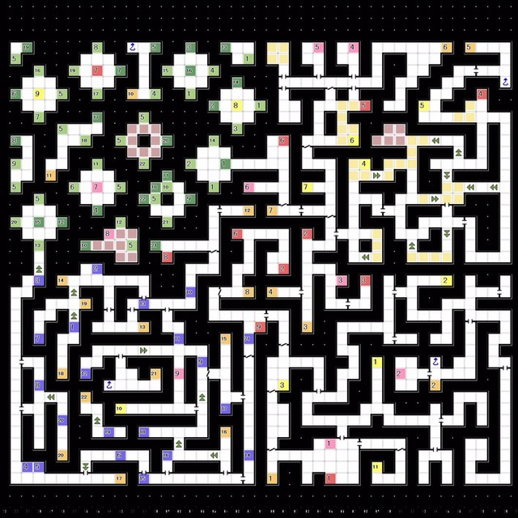
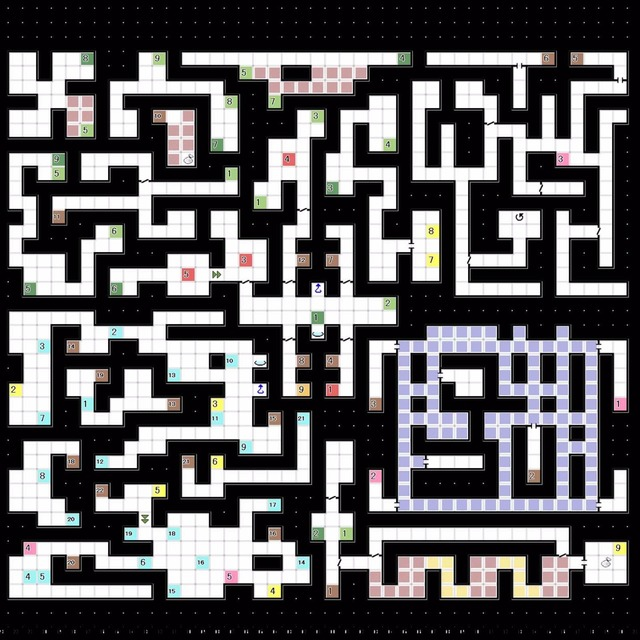

# 波江座 
### 1F & 2F  
  

1F
 

2F
 
- 1F：经由 阶梯2 前往2F
- 2F：经由 阶梯3 回到1F
- 1F-E6:使用传送装置
- 传送点2 -> 传送点3 -> 传送点4 -> 传送点6 -> 传送点7 -> E7
- 1F-E7:获得稀有素材「氢苹果」
- E7 -> 传送点8 -> 传送点9 -> 传送点21 -> E8
- 1F-E8:获得稀有素材「九重冰石」
- 1F-E8 -> 阶梯15 -> 2F-落穴12 -> 阶梯21 -> 2F-落穴21 -> 1F-E9
- 1F-E9:获得稀有素材「X金属」
- -   回到船底座将素材交给杰克上校