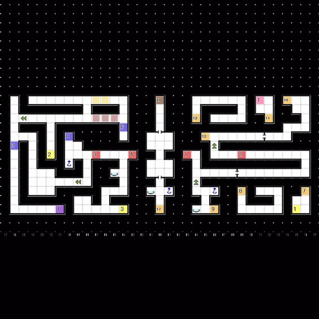
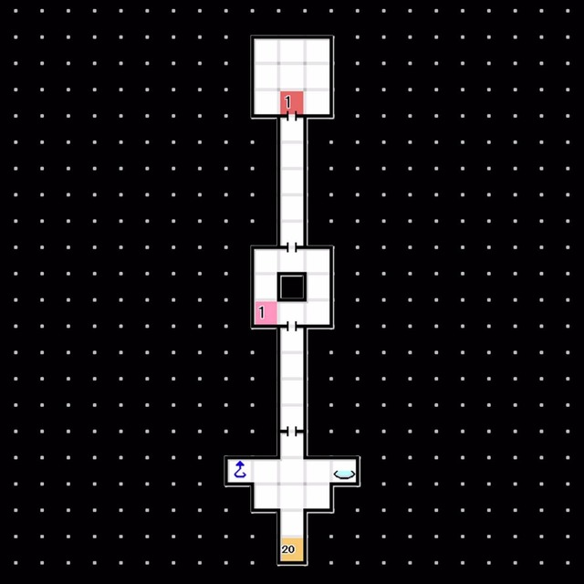

# 天炉座 
### 中央路线-B5F  
 
- 获取「敌人搜索C」后可以继续前进了
- 与 Lv50「恶灵 谜之恶魔」战斗

 

### B6F  
 
- E1:与「地母神 阿瑟拉」对话
  └ 「破坏正是为大地带来美的力量」
  &emsp;└ 不许你破坏大地 / 或许是这样 / 这只是恶魔的狡辩
- Boss Lv53 「地母神 阿瑟拉」
  HP 约2600 反风火 耐电枪 弱冰 大致攻略要点与「魔王 阿修罗」相去不多
- 经由 管制点 进入隐藏空间
- 经由 阶梯2F 下至B7F 
  
隐藏空间A
 
  
隐藏空间B

 

### B7F  
 
- E1:Boss战，此战较难请多做准备
  Lv55「邪龙 提亚马特」
  HP 约4500 耐枪 弱电 吸冰
  Boss会释放大量具有回复效果的技能
  技能「风林火山全阵」 提升Boss所有能力值一阶段
  技能「母之大地」对我方造成冰属性伤害并回复Boss造成伤害一半的血量
  技能「黄昏的旋律」对我方全体造成万能属性伤害并降低攻击力一阶段
  如果Boss使用了「风林火山全阵」，强化自身能力，打消之。尽量不要使用DEBUFF,不然Boss会释放技能回复自身血量
  **一定不要尝试使用「魔反镜」或者其他魔法反射的技能来规避伤害如果您这样做，Boss将使用「迪亚拉翰」，回满自身血量**
  值得一提的是，Boss不具备打消能力，带上各种BUFF强化自身能力，此战就没什么难度了
  胜利后「邪龙 提亚马特」合体解禁，获得「邪龙的盐块」「EX物质：天炉座」
- 强制回到红色精灵号
  
  