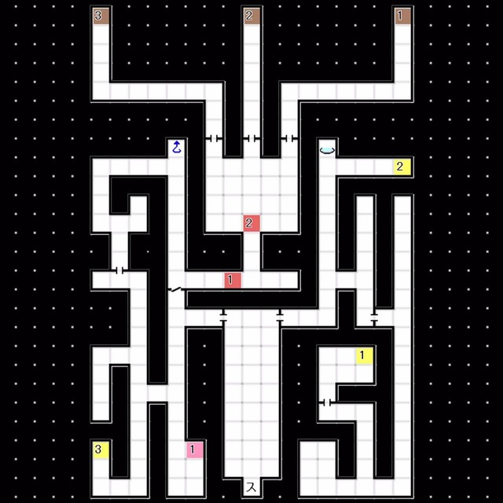

# 天炉座 
### 1F 
 
- E1:与「魔王 摩洛克」对话
  └ 「好好了解我们恶魔的伟大吧！」
  &emsp;└ 已经了解了 / 去没有人类的地方生存吧 / 恶魔应该被尽数消灭
- 与 Boss Lv46「魔王 摩洛克」战斗
  HP 约2200 耐枪电 反火 弱冰
  具体攻略方法与摩拉克斯差别不大且难度不高，胜利后「魔王 摩洛克」合体解禁
- E2:与 三只恶魔 以及 露易·塞珐尔 对话