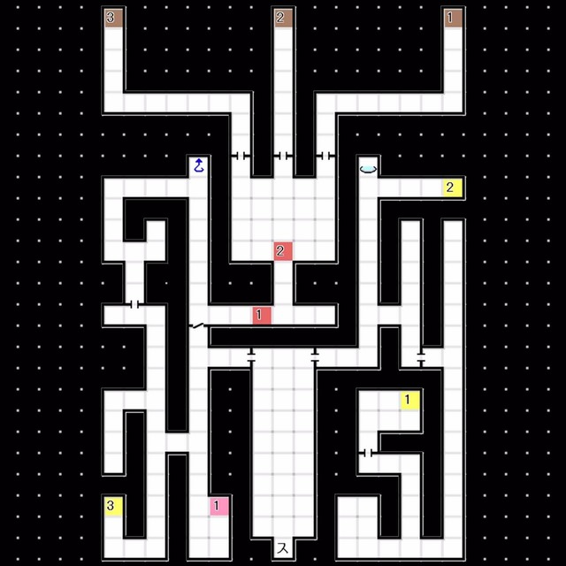
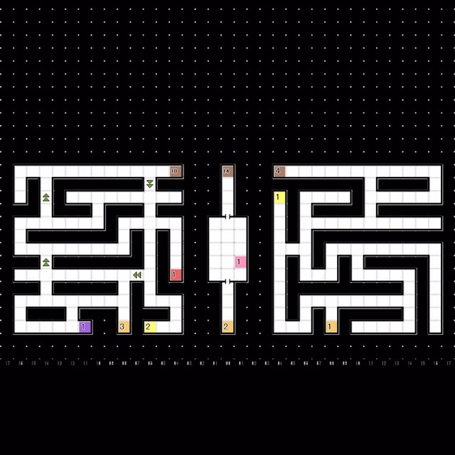
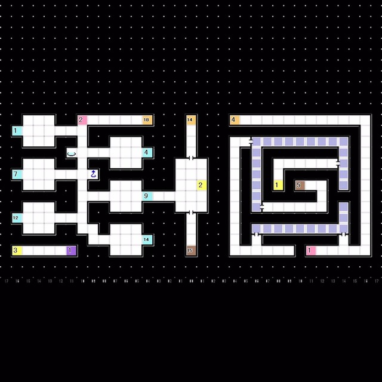
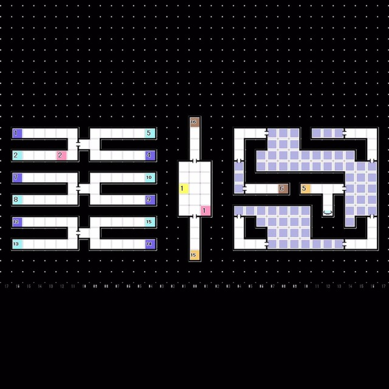
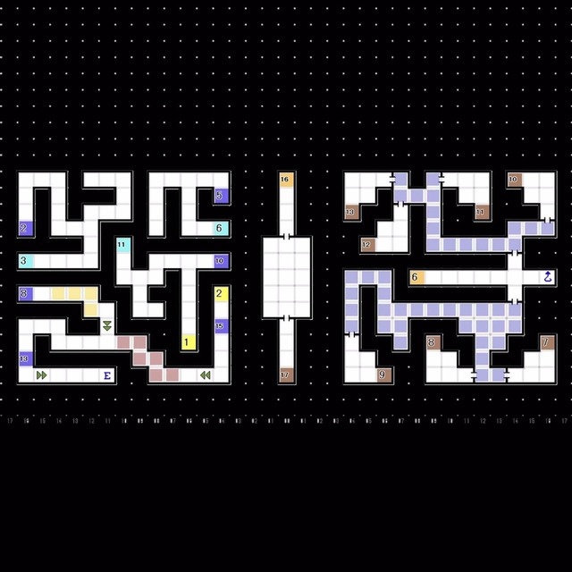
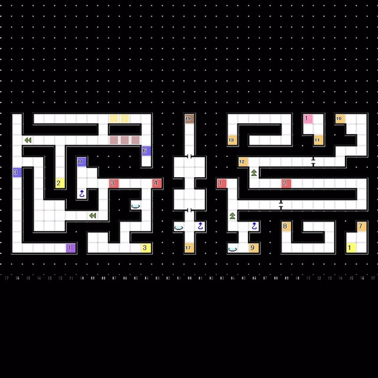

# 天炉座 
### 1F  
 
- 右边的路线
  └ Boss「死神 奥尔库斯」
- 左边的路线
  └ Boss「堕天使 密斯拉」
- （由中间下到B5F后会受到伤害且无法再继续前进，请先选择任意一条路线击破Boss以推进剧情）

 

左侧线路 
 

B1F
 

B2F
 

B3F
 

B4F
 

B5F
 
- 经由 B2F-落穴9 前往B3F
- 经由 B3F-落穴10 前往B4F
- 经由 B4F-落穴11 前往B5F
- B5F-E4:获得稀有素材「太阳镜」
- B5F-E3:与「堕天使 密斯拉」对话
  └ 「人类是要由我们来统治的！」
  &emsp;└ 为什么不能共存呢 / 那是邪恶的想法 / 也许你说的没错
- Boss Lv50「堕天使 密斯拉」
  HP 约2500 耐枪火 弱风 无冰
  技能「秩序之光」对我方 魔属性 最低的单位造成即死，请注意
  技能 「虚幻梦」 造成万能伤害并附带 消沉 状态，请注意
  总体难度不高，带上物理耐性或者冰结耐性的仲魔并注意回复即可轻松取胜

 

### 右侧路线  
- 先前往B5F
- B5F-E1:获得稀有素材「干支月宫镜」
- B5F-E2:与「死神 奥尔库斯」对话
  └ 「你也在死亡面前尽显丑态吧」
  &emsp;└ 我不会在这里死掉的 / 死亡根本不足为惧 / 就算死了灵魂也会存在
- Boss Lv51「死神 奥尔库斯」
  HP 约2400 耐物枪冰 弱火电 
  攻略方式与「魔王 奥伽斯」相差不大，难度不高 
---
 
# 击败任意Boss后  
- 发生事件，回到红色精灵号
- 前往杰克部队基地
- 与 杰克部队兵 对话
- 回到红色精灵号，发生事件
- 将产生两次对话，但无论什么选项都不影响剧情或主角立场
- 想要继续推进剧情的话，请前往天炉座击败剩下的Boss