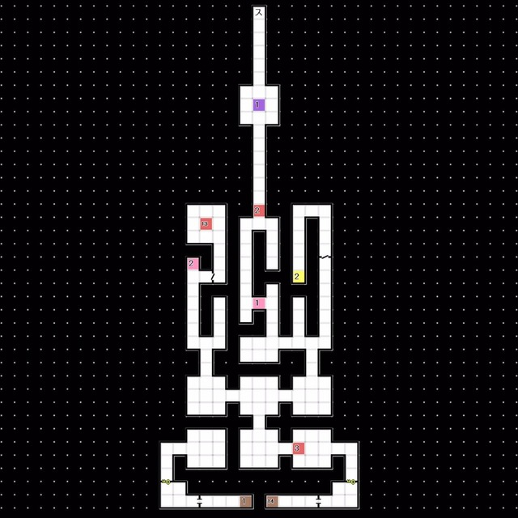
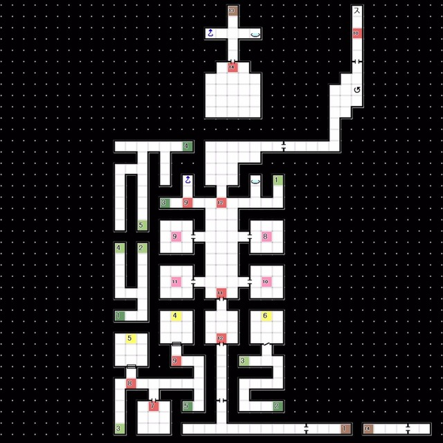

# 红色精灵号  
- 获得「巨人之牙」
- 前往研究室制造主要应用「亚空间区域扫描B」 
---
 
# 天鹤座 
### 1F  
 
- 经由 管制点 前往隐藏空间B

 

### 1F 隐藏空间B 
 
- E7:与 恶魔首领 对话  
  └「如果把那群人类处理掉的话，我也可以解除封印的」
  &emsp;└ 拒绝 / 明白了 / 让我再考虑一下
前往E7需经过一系列传送点：1 -> 4 -> 5
- E9:与 希门尼斯 对话
- E10:与 婕涅宁 对话
  └「婕涅宁的样子很奇怪」
  &emsp;└ 打招呼 / 观察
  「这个提案你觉得怎么样？」
  └ 谢谢，一定要去唱 / 不好意思，没必要 / 再让我考虑一下
- 回到红色精灵号后发生事件
  └「接受与天鹤座的恶魔们的交易吗？」
  &emsp;└ 与他们交易就好 / 这可不行
  └「是否借助婕涅宁中尉令天鹤座的恶魔无力化」
  &emsp;└ 就交给婕涅宁吧 / 不应该拜托她
- 根据主人公的选择将进入下记三条线路中的一条
  ├ 婕涅宁咏唱路线
  ├ 强行突破路线
  └ 杰克部队全灭路线

---
 
# 天鹤座-婕涅宁咏唱路线 
- 天鹤座入口与 婕涅宁 对话
  └「要请婕涅宁唱歌吗？」
  &emsp;└ 好 / 不要
- E12:婕涅宁咏唱 
---
 
# 天鹤座-强行突破路线  
- E7:与 恶魔首领 对话  
  └「要打倒恶魔强行突破吗？」
  &emsp;└ 好 / 不要
- 与 Lv49「邪鬼 格兰蒂尔」战斗，耐物枪 
---
 
# 杰克部队基地-杰克部队全灭路线 

 
- E4:「要前去歼灭杰克部队吗？」
  └ 好 / 不要
- 与 Lv50 「人类 瑞安」战斗
- 胜利后前往天鹤座1F-E7，告知恶魔首领 
---
 完成上述三条路线任意一条后即可前往天炉座1F隐藏空间B E11处 打开被封印的大门