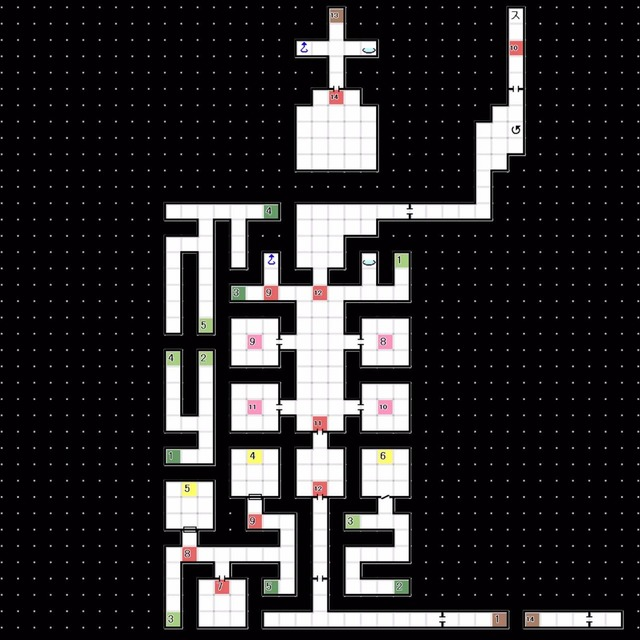

# 天鹤座 
### 1F隐藏空间B 
 
- E11:打开门的封印
- E12:戈尔队长的幻觉

 

### B1F 
 
- 经由 阶梯2 降至B2F

 

### B2F  
 
- 经由一系列传送点前往 阶梯5，降至B3F
  └ 3 -> 4 -> 5 -> 6 -> 7 ->  8 -> 11 -> 12 -> 13-> 15 -> 16

 

### B3F  
 
- 经由中间的阶梯前往B2F

 

### B2F  
 
- 在B2F中央（E1）获得稀有素材后回到红色精灵号制作主要应用 「解锁C」
- 打开锁住的门前往1F的Boss房
- 在1F与 Boss Lv63 「夜魔 摩耶」 战斗 HP约6000 弱枪
  └  胜利后「夜魔 摩耶」合体解禁，获得「夜魔的甘露酒」「EX物质：天鹤座」
  使用物理或者枪属性以外的攻击会受到Boss反击「永恒的处罚」即死
- 强制回到红色精灵号