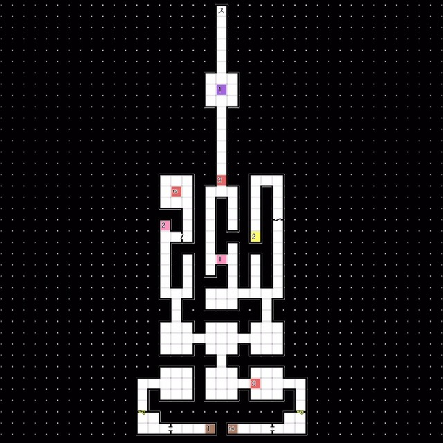

# 天鹤座  
### 1F 
 
- 经由 管制点 前往隐藏空间A 
--- 
 
### 1F 隐藏空间A 
 
- 按以下顺序前往E6 
  └ 传送点2 -> 传送点3 -> 传送点4 
- 与 马赛蒙特 对话
  └「那么，你们二位作何打算？」
  &emsp;└ 表明自己愿意成为天使 / 沉默不语
- 与 婕涅宁 对话  
  └「因光明力量而得到新生的我...?」
  &emsp;└ 很美丽 / 很恐怖 / 没有什么问题
- 回到红色精灵号 
--- 
 
# 杰克部队基地 
### 1F 
 
- E4:婕涅宁 事件
- 回到红色精灵号