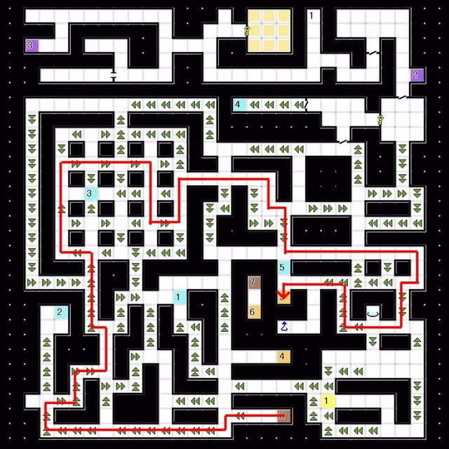
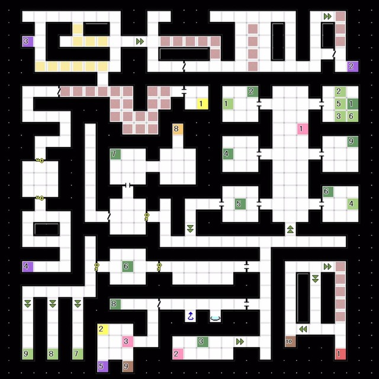
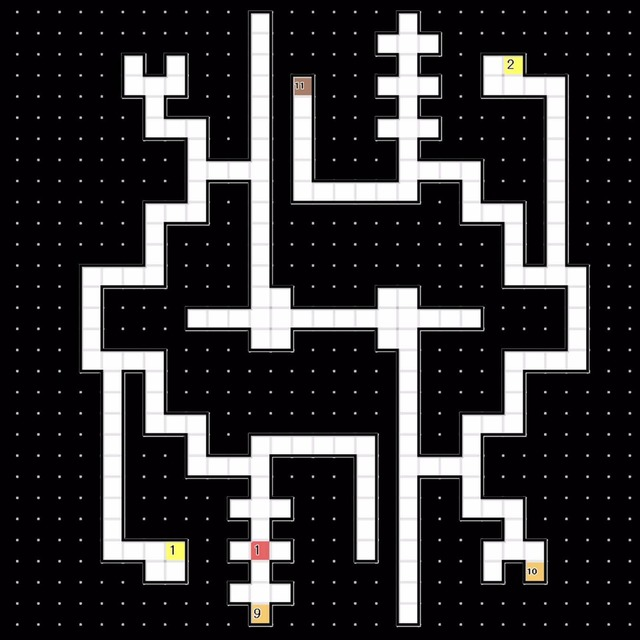
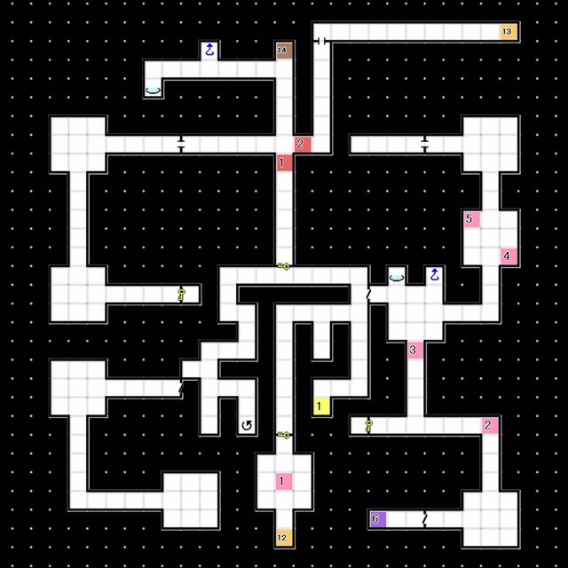
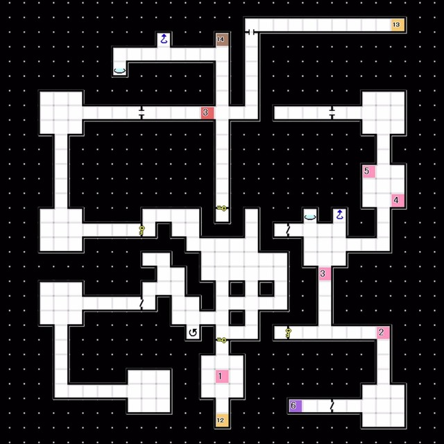

# 时钟座 
### 1F 
 
- E1:Boss Lv63 伊斯拉斐尔
- 获得「御先之勾玉」，前往研究室制造「暗门搜索D」

 

### B1F 
 
- 乘右侧的 电梯2 前往B2F

 

### B2F 
 
- 乘右侧的 电梯3 前往B4F
- 乘电梯4前往B3F

 

### B3F 
 
- 登上 阶梯3 前往B2F
  └ B2F:登上地图中央附近的 阶梯5 前往B1F
  &emsp;└ 下楼到B3F
  &emsp;&emsp;└ 经由 阶梯8 降至B4F
 

时钟座B2F最短路线

 

### B4F 
 
- 经由一系列传送点前往阶梯9
  └ 1 -> 6(满月时) -> 8

 

### B5F  
 
- E1:Boss Lv66 「大天使 马赛蒙特」   
  弱火 反枪冰风
  马赛蒙特主要的攻击手段是 风 光 万能 和 魅惑
  普通攻击是全体攻击
  注意带上光属性的仲魔，多多使用BUFF/DEBUFF，为了避免被打消不要超过+2/-2
  其实很简单，比起L线和N线来说，马赛蒙特甚至有个不会改变的弱点属性呢
  胜利后「大天使 马赛蒙特」合体解禁

 

### B6F  
 
- 目标是 阶梯12，被熔岩堵塞的道路无法通过
  └ 按下E1处的开关，之后下楼
- E2:稀有素材「灵鸟石」
  └ 回到研究室制造「不可视区域扫描C」

 

### B7F 
 
- E1:按下开关
- E2:经由B6F右上的 阶梯13 回到B7F，启动开关
- 经由 管制点 前往隐藏空间A

 

### B7F 隐藏空间A  
 
- E3:按下开关
  └ 合计按下三个开关后堵住道路的墙壁消失，可以继续前进

 

### B7F 隐藏空间B 
 
- 有 存档点 回复点 以及回到1F的捷径电梯

 

### B9F 
 
- 若攻略了叹息之叹第六圈，开BOSS房门时亚丽克斯出现，对话中选择「不应该死」则进入新版结局，否则进入原版结局。未攻略时自动进入原版结局
  