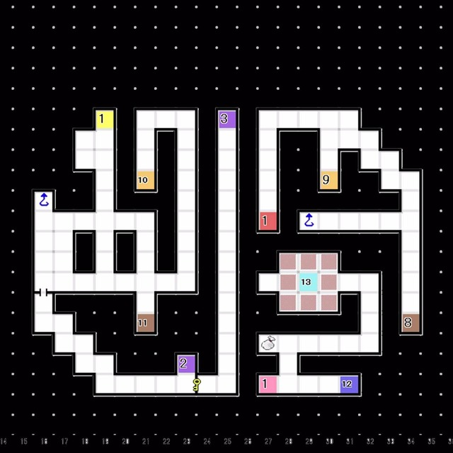
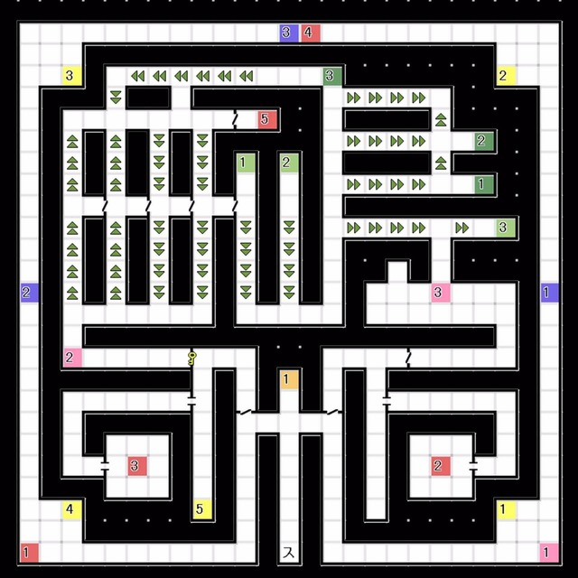

# 唧筒座 
### 1F  
 
- E12:与 齐天大圣 对话
  └ 获得「第一宇宙卵」

---
 
# 牧夫座 
### 6F 
 
- 打开锁住的门，乘电梯前往7F

 
### 7F 
 
- E2:Boss「灵鸟 八汰乌」x3
- 获得「第二宇宙卵」 
---
 
# 船底座 
### 2F隐藏空间B 
 
- E4:与 烛阴 对话
  └ 获得「第三宇宙卵」

---
 
# 海豚座  
### 1F  
 
- 打开锁住的门，前往E5按下开关，打开所有隐藏门后再次按下开关前往电梯
  └ 路径为：传送点1 -> 传送点3 上方地图有遗漏，电梯在对话点3旁的凹槽处

 

### 9F 
 
- E1:Boss Lv62 「天使 智天使」
- 获得「第四宇宙卵」