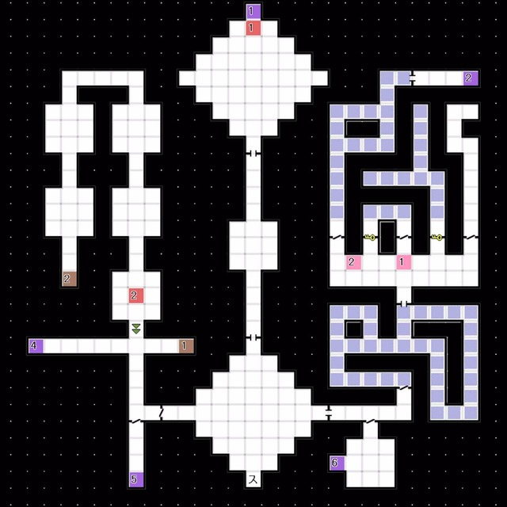
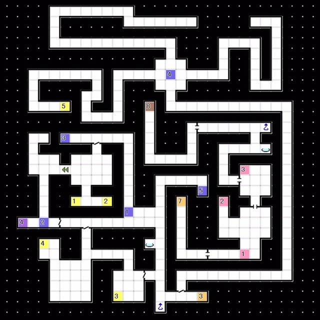
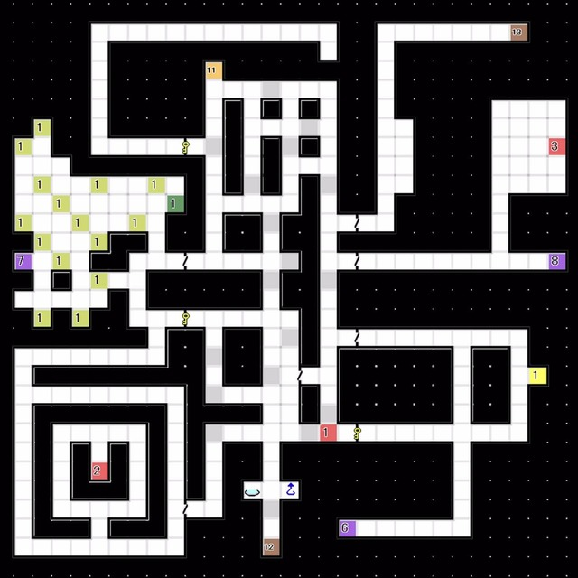
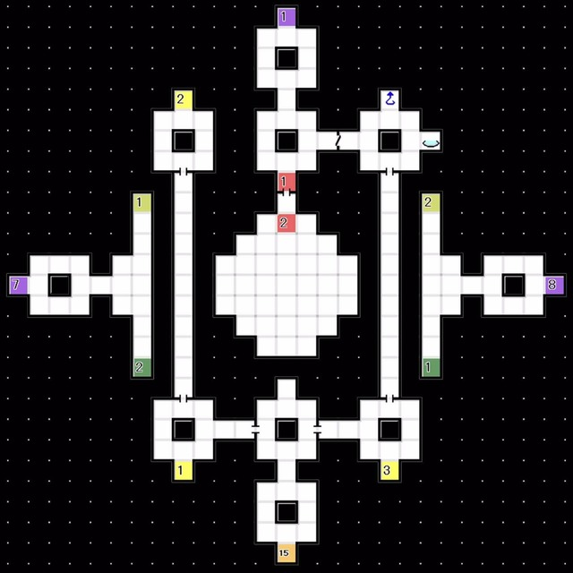

# 时钟座  
### 1F 

 
- E1:电梯被破坏了，Boss Lv63「魔王 苏鲁特」
- 获得「御先之勾玉」
  └ 回到研究室制造「暗门搜索D」

 

### B1F B2F B3F B4F 
- 打开1F东边的隐藏门，乘坐电梯 

B2F
 
- 经由位于B2F-电梯2反方向的电梯3降至B3F
- 经由B3F右下方的阶梯3前往B2F 

B3F

 

### B2F 

- 前往 阶梯5 

B2F最短路线图

 

### B4F  
 
- 经由一系列传送点前往B5F
  └ 1 -> 6（满月时）-> 8

 

### B5F  
 
- E1:Boss Lv70 「大地人 希门尼斯」
	HP 8000 弱冰 耐枪 吸火
	战斗进行到一半后希门尼斯将变为开始吸收冰属性攻击
	Boss造成**大量物理·枪属性伤害**
	好好准备，没有对应的物·枪耐性的话希门尼斯很可能一击就结束战斗
	多使用BUFF/DEBUFF，但是到了+2/-2就ok了，不然希门尼斯就会进行打消
	有对应耐性的话不会太难

 

### B4F  
 
- E1:获得稀有素材「求闻持之镜」
  └ 回到研究室制造「敌人搜索C」

 

### B6F  
 
- E1:按下开关
  └ 熔岩消失，继续前进
- E2:获得稀有素材「灵鸟石」
- └ 回到研究室制造「不可视区域扫描C」

 

### B7F  
 
- 空中有隐形地面
- E1:按下开关1
- E2:经由B6F右上的阶梯下来，按下开关2
- 经由管制点前往隐藏空间A

 

### B7F 隐藏空间A  
 
- E3:按下开关3
  └ 按下合计三个开关后，墙壁消失，可以前进
- 隐藏空间B有存档点，回复点以及通往1F的捷径电梯

 

### B9F 
 
- E2:二连战 Boss Lv76「大灵母 玫母阿尔法」Boss Lv80「虚大灵 玫母阿尔法」
- Boss Lv76「大灵母 玫母阿尔法」HP 7500 无枪
  - 技能
    - 「冰·火·水·风」
      └ 各属性全体攻击（威里特大）
    - 「暗·光」
      └ 对全体造成即死（概率高）
    - 「阿修罗之瘴」
      └ 对全体附加 MAD 
    -「 太母之吻」
      └ 随机造成多次物理伤害（威力大，随机造成3-8次伤害）
    - 「秩序之光」
      └ 对 魔 最低的单位造成即死
    - 「大洪水」
      └ 对全体造成万能属性伤害（威力大），并降低命中率·回避率一阶段
    - 「灾厄的轮回」
      └ 对全体造成万能属性伤害（威力大），并附加各种异常状态
    - 「始祖之理」
      └ 打消全体的辅助效果并回复自身HP
	Boss没有任何弱点，此战很难打出恶魔CO-OP,但同时也意味着配队不需要担心仲魔立场不一
	针对 「火·电·风·冰」可尝试带上具有反射耐性的仲魔
	针对 「光·暗」，请确保仲魔具有光暗属性耐性，或者带上技能「即死防御」
	相比仲魔，主角的生存更难保证，请尽量在主角80级后再来挑战
	担当回复役的仲魔推荐「龙神 黄龙」或者「魔人 吹号天使」，后者在B8F进行敌人搜索即有概率与吹号天使战斗，胜利后解锁合体
- Boss Lv80「虚大灵 玫母阿尔法」HP9000 物理·枪·火·冰·电·风属性的耐性会改变  
	- 技能与前一战基本一致，此战不会使用「阿修罗之瘴」
		- 新技能：
			- 「母体回归」
			  └ 使随机一种倾向的仲魔回到储备区
			- 「MA」
			  └ 对单体造成与现有HP等量的伤害并回复等量HP
	- 每次使用技能「母体回归」都将改变自身耐性为以下随机一种,战斗开始时为下记第6种抗性：
		1. 弱冰/反枪·火
		2. 弱电/反火·冰
		3. 弱风/反冰·电
		4. 弱物/反电·风
		5. 弱枪/反物·风
		6. 弱火/反物·枪
	此外攻略法与「大灵母 玫母阿尔法」基本相同，为了应对「母体回归」以及「MA」，可以带上具有技能「招来的舞踏」或者「仲魔招来」的仲魔
- 若在此之前通关了新版追加地牢「叹息之胎」回到Boss房前有存档点和回复点的地方，将发生事件。若未攻略叹息之胎第六圈则自动进入旧Law结局，与亚丽克斯战斗。若在此之前通关了新版追加地牢「叹息之胎」，且在对话中选择「不应该有人被舍弃」，则进入新版结局。接到新任务「宇宙卵的夺还」，前往新地牢「十天往途」。
 