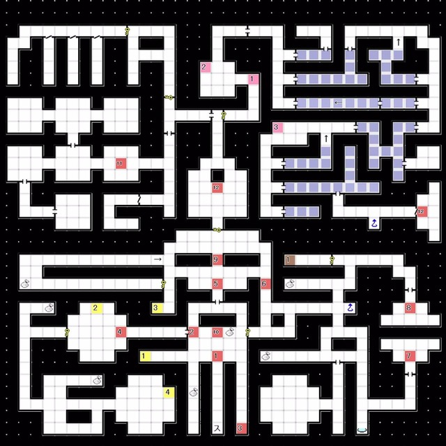
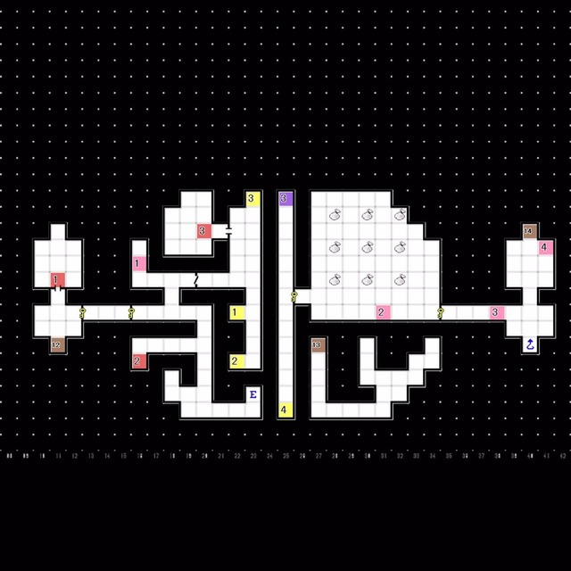

# 唧筒座-1F  
 
- 直行，打开以前打不开的门
- E12:Boss Lv54 「破坏神 齐天大圣」 弱冰电
- 获得「第一宇宙卵」 
---
 
# 牧夫座 
 
- 乘电梯前往5F，换乘旁边的电梯前往6F

 

### 6F 
 
- 打开电梯旁的门，走到尽头，乘电梯前往8F

 

### 8F  
 
- 经由 阶梯15 降至7F

 

### 7F 
 
- E2:Boss Lv67 「审判者 婕涅宁」
- 获得「第二宇宙卵」「四号舰的核弹头」 
---
 
# 船底座  
### 2F 隐藏空间B  
 
- E4:Boss Lv64 「龙神 烛阴」无弱点
- 获得「第三宇宙卵」 
---
 
# 海豚座  
### 1F  
 
- 打开锁住的门，前往E5按下开关，打开所有隐藏门后再次按下开关前往电梯
  └ 路径为：传送点1 -> 传送点3 上方地图有遗漏，电梯在对话点3旁的凹槽处

 

### 9F 
 
- E1:Boss Lv62 「天使 智天使」
- 获得「第四宇宙卵」
